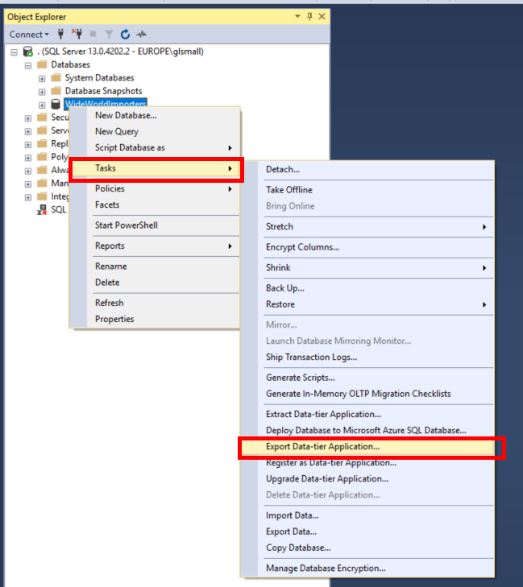
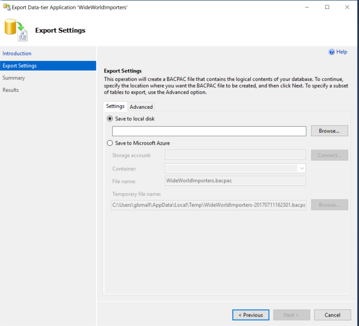

# Fast Track for Azure - SQL Database

This folder is work in progress, please stay tuned! 

# Abstract

During this module you will learn the process for exporting a database from a physical or virtual SQL Server which can then be imported into Azure SQL Database

# Learning Objectves

By the end of this module you will be able to:

* Export a Database to bacpac
* Upload a bacpac to Azure Blob Storage

## Pre-Requisites

* To complete this module you will need:
    * A local instance of SQL Server or a SQL VM
    * SQL Server Manageemnt Studio
    * A Database running on that local or VM insatnce of SQL Server
    * AZCopy which can be downloaded from [here](https://docs.microsoft.com/en-us/azure/storage/storage-use-azcopy)
    * An Azure Storage Account

# Estimated time to complete this module:
Self-guided (10 minutes approx)

# Exporting a Database

Exporting a database from a physical server or virtual machine makes use of the built in functionallity of SQL Server.  Data exports to Azure use the BACPAC file format, which is a specific type of zip file that contains metadata for the structure of teh databse as well as teh actual data its self.  To export a database to a bacpac file you need to:

* Right click on the database in SQL Server Management Studio
* Select "Tasks" from the context menu
* Select "Export data tier Application" from the next context menu

    

Within the Export Database Wizard you can specify whether to export the database to a local file, or to export to a temporary local file and the upload directly into Azure Blob Storage.

Uploading directly to blob storage is only suitable for smaller databases.  For better performance you should export the bacpac locally and then use [AZCopy](https://docs.microsoft.com/en-us/azure/storage/storage-use-azcopy) to upload the file to blob storage

For very large databases you should consider using the Azure import/export service to transfer the data. [https://azure.microsoft.com/en-us/pricing/details/storage-import-export/](https://azure.microsoft.com/en-us/pricing/details/storage-import-export/)

