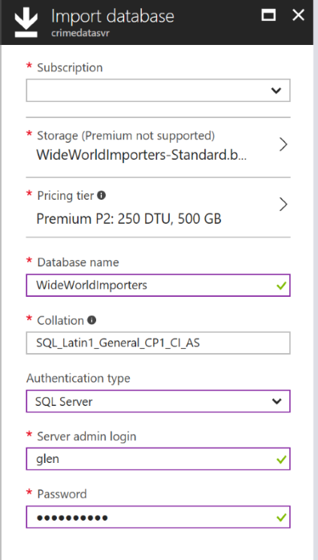
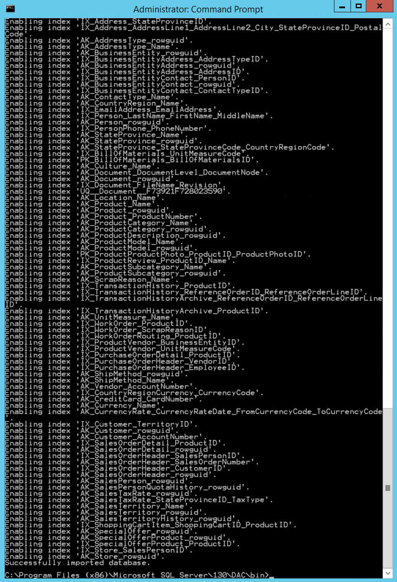

 # Fast Track for Azure - SQL Database

This folder is work in progress, please stay tuned! 

# Abstract

During this module you will learn how to import a database into Azure SQL Databse using a database extract (bacpac)

# Learning Objectves

By the end of this module you will be able to:

* Import a database into Azure SQL DB from a backpac file

## Pre-Requisites

* To complete this module you will need to:
    * Download the reference dataabase [WorldWide-Importers-Standard.bacpac](https://github.com/Microsoft/sql-server-samples/releases/download/wide-world-importers-v1.0/WideWorldImporters-Standard.bacpac)
    * A Storage account and a container in blob storage
    * The reference database uploaded to the container in blob storage
    * You should have completed the Create-blank-azure-sqldb Turorial First or have an existing logical SQL Server created.

# Estimated time to complete this module:
Self-guided (10 minutes approx)

    
# Importing a Database

To start the import process you need to: 

* Click on the SQL Server to open the Server blade
* Press "Import Database" from the menu at the top

    

On the SQL Database blade you need to:

* Select your subscription from the dropdown menu
* Browse to the .bacpac file that you uploaded into blob storage
* Change the Pricing Tier to Premium P2 for the imoprt
* Rename the database to "WorldImporters"
* Change the Authentication to SQL Server
* Enter the useranme and password that you used to provision the logical server with
* Press OK to start the import

**NOTE**
>You should set the pricing tier when importing a databse to a Premium level so that the impport can complete quickly with plenty of resources.  Once imported you can scale the database down to a standard level if required.
>



# Monitoring the Import Progress

Once the import is underway, you can monitor the progress by clicking on the Import/Export History tile located on the logical SQL Server blade.


# Using SQLPackage.exe

For performance and reliablity when migrating production databases and larger databases, it is recommended to use the SQLPackage.exe utility that ships with SQL Server Management Studio and SQL Server Data Tools.

```cmd
SqlPackage.exe /a:import /tcs:"Data Source=mynewserver20170403.database.windows.net;Initial Catalog=myMigratedDatabase;User Id=ServerAdmin;Password=<change_to_your_password>" /sf:AdventureWorks2008R2.bacpac /p:DatabaseEdition=Premium /p:DatabaseServiceObjective=P6
```




