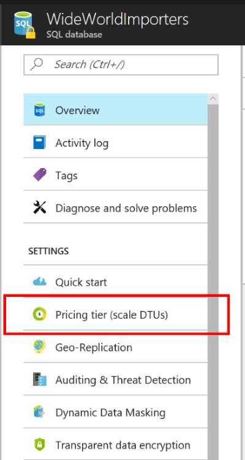
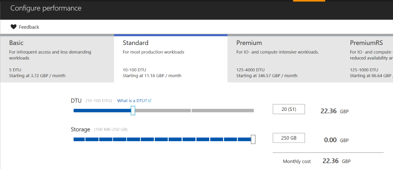

# Fast Track for Azure - SQL Database

This folder is work in progress, please stay tuned! 

# Abstract

During the import of the WorldImporters database you set the performance tier to Premium P2 so that the import would complete quickly and so the import process had enough resources available to do the import.  In this module you will learn how to scale an existing Azure SQL Database up and down through the performance tiers

# Learning Objective

By the end of this module you will be able to:
* Scale up and down a Database using the portal

## Pre-Requisites
* To complete this module you will need to have completed the create server and import database modules

# Estimated time to complete this module:
Self-guided (10 minutes approx)

# Scaling Down a Database

To scale a database down from premium to standard you need to:

* Connect to the portal at [https://portal.azure.com](https://portal.azure.com)
* From the left hand menu select **Databases**
* Select the **WorldWideImporters** database from the list
* From the Database blade, select **Pricing tier (scale DTUs)**

From the Pricing blade, select the **Standard** tab and the move the DTU slider down to **S1**

Click **Apply** for the scale operation to take place.

**NOTE** *while a scale operation is taking place, the database is still accessible and you can connect to the database using SQL Server Management Studio (SSMS) to test this.*

# Scaling Up a Database

To scale a database up, the process is exactly the same as it is for scale down.  Simply select the tier you require and hit apply.

